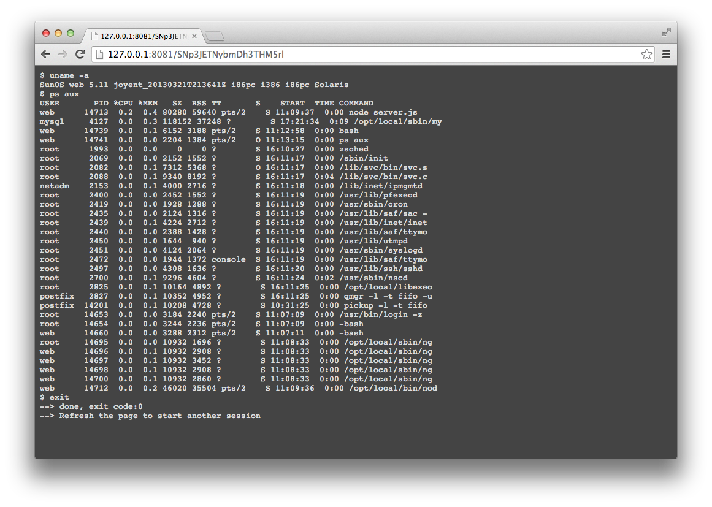
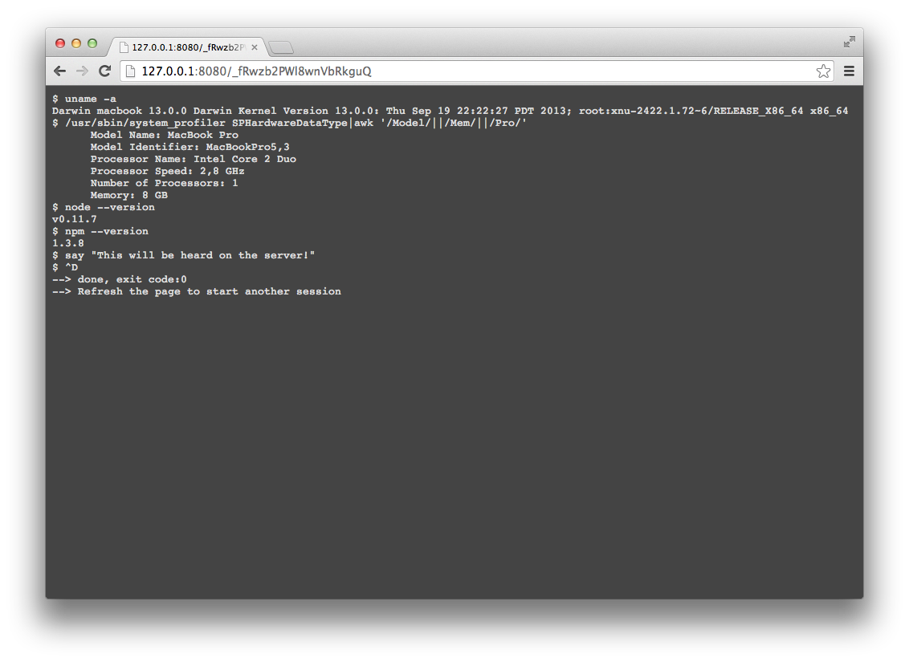

NodeJs - terminal-server
========================

Serve a shell in a browser, each tab/new connections open a new bash.

See [Screenshots](#shortcuts)

Installation:
-------------
- Install nodeJS if needed (0.10+ recommended)
- Clone this repo
- Install dependencies: `npm install`
- Run: `npm start`
- Browse
 
Note: The URL path is auto-generated and displayed on startup.

DISCLAMER
---------
**Don't** serve a shell on any public network or be sure to understand the risks. 

Known bugs:
-----------
The scrolling isn't implemented so use `clear` to empty the screen.
Ctrl-C doesn't interupt child programs, so it has been mapped to kill the bash.

Shortcuts:
----------
- Ctrl-D exit 
- Ctrl-C kill
 
Screenshots:
------------

